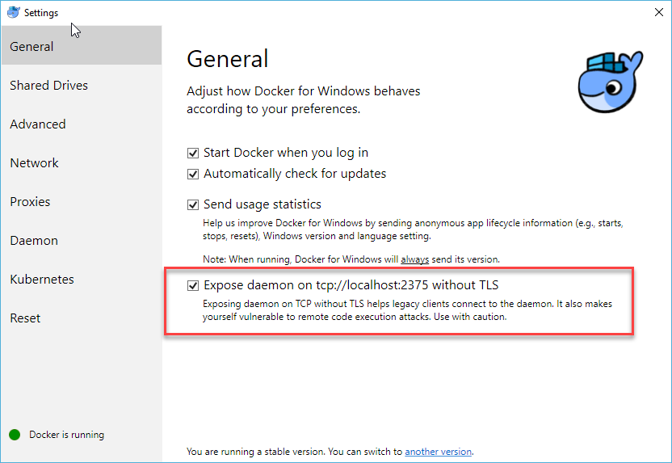
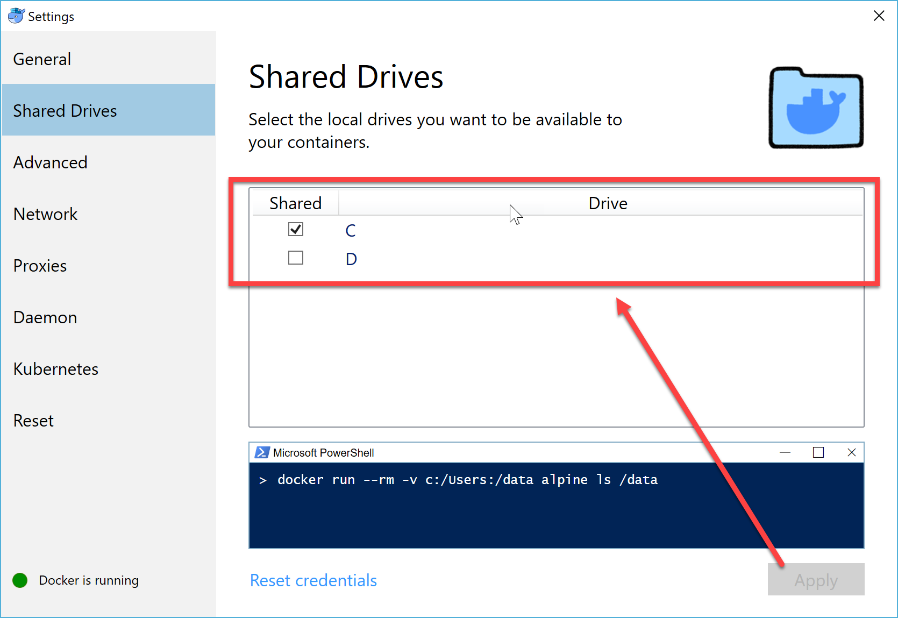

EOS Easy Contract
============

EOS Easy Contract allows EOS developers to get started writing smart contracts in minutes, not hours! 

EOS Easy Contract allows you to create a smart contract without having to compile any software and does not require knowledge of the complex EOS ecosystem used to build its contracts. 

EOS Smart Contracts are written in C++, and configuring a development environment to compile those smart contracts can be time consuming and much of the tooling is not yet available for Windows developers. 

How does EOS Easy Contract pull this together? First, all of the tooling needed is packaged into a Docker container. When it comes time to compile your code, EOS Easy Contract runs all the needed commands inside the docker container and gives you back the result (.wasm file) which can then be uploaded to the EOS network. 

EOS Easy Contract provides tooling to quickly:
1. Create a starting Visual Studio Code template. 
2. A watcher application that will build your code every time you save. 
3. Allow Visual Studio Code to report errors back in a helpful way. 

Suported Platforms
------------
Currently Supported on: __Windows__, ~~OSX~~ (coming soon), ~~Linux~~ (coming soon)

Requirements
------------
- Docker (free) - https://www.docker.com/get-started
- Visual Studio Code (free) - https://code.visualstudio.com/download

Getting Started
------------

1. Download ( https://github.com/eosnewyork/EOSEasyContract/releases ) and decompress the software (in this example we'll decompress the .zip file to a folder c:\tools\EOSEasyContract)

2. Initialize you environment

```
# Your command prompt must have Admin rights as this will try to add a variable to your PATH
> cd c:\tools\EOSEasyContract
> EOSEasyContract.exe init windows
````

2. Test docker and download missing images

Before executing the following commands, ensure that you this following setting is set correctly in your docker settings. 







```
> cd c:\tools\EOSEasyContract
> EOSEasyContract.exe init docker
````

4. Generate a project from template

```
> EOSEasyContract.exe template new --path c:\temp --name EOSTemplate1
````

5. Open the project in Visual Studio Code, using the below instruction or simply launch the GUI and open the folder

```
> cd c:\temp\EOSTemplate1
> code .
````

6. Once in Visual Studio code, run the Build task by pressing CTL+SHIFT+B

You should see output that looks as follows in your Visual Studio termnal window. 

```
> Executing task: EOSEasyContract.exe build --path "C:\temp\EOSTemplate1" --watch <

Begin watching C:\temp\EOSTemplate1. Build using docker image XXXXXXXXXXXXXXXXX.
```

7. Save the .cpp or .hpp file in the project, and watch the magic happen. 

You should see somethin like this in the terminal window:

```
        =========== Building eosio.contracts ===========


-- Setting up Eosio Wasm Toolchain

-- Configuring done

-- Generating done

-- Build files have been written to: build

Scanning dependencies of target EOSTemplate1.wasm

[ 50%] Building CXX object CMakeFiles/EOSTemplate1.wasm.dir/EOSTemplate1.cpp.o

[100%] Linking CXX executable buddy1.wasm

[100%] Built target EOSTemplate1.wasm

End EOSIO contract build
Done Building. Build Duration = 00:00:08.0230652
```

8. The result of the build will be placed into a sub folder called "build" 

```
C:\temp\EOSTemplate1\EOSTemplate1.wasm
```
